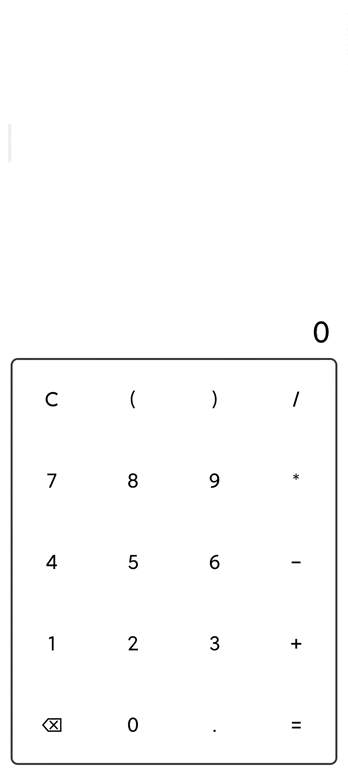

## Compose Calculator

This project is a simple calculator built by Jetpack Compose. 

Click [here](app-release.apk) to download it.

### Highlights

- Custom Layout
  - `SubcomposeBottomFirstLayout`: A layout which measures the bottom `Composable` first and calculates the size of other  `Composable` then.
  - `CalcInput`:  Calculate the box's size based on the shape of character array.

- Large-Screen Adaptation
  - Use  `BoxWithConstraints` to choose the appropriate layout based on the width of screen.
- Animation
  - Do animating when inputting the formular (by `Animatable`)
  - Do animating when the history item enters into the screen (by `LaunchedEffect` + `animateXXXAsState`)
- Immersion: Full screen without any disturbance
- Dark Mode Adaptation

### Screen Shot/Record

#### Dark Mode

